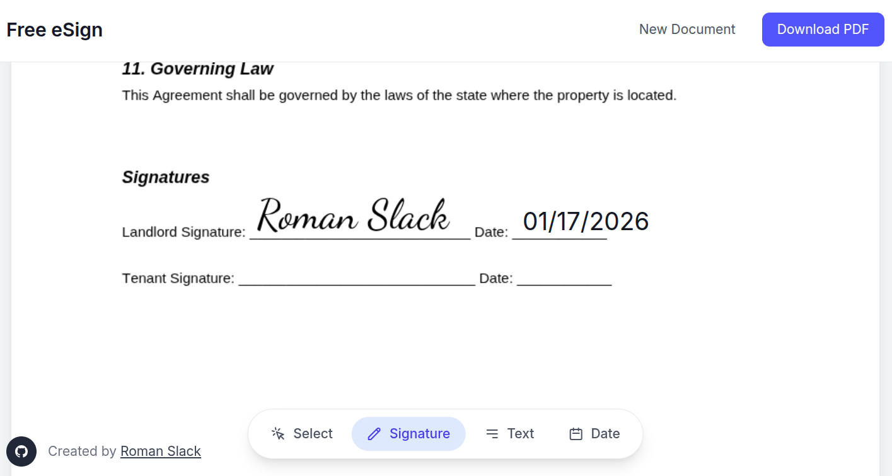

# Free eSign Website




A free, open-source e-signature web application for signing documents online. Upload a PDF, add signatures, text, and dates, then download your signed document instantly. No login required, no accounts, no restrictions. All processing happens in your browser for complete privacy.

## Features

- PDF upload with drag and drop support
- Three signature creation methods: draw, type, or select from signature fonts
- Add text fields and date stamps
- Drag, resize, and edit placed elements
- Export signed PDF with embedded signatures
- Fully client-side processing for privacy

## Tech Stack

- **Framework**: Next.js 15 with App Router
- **UI**: React 19, Tailwind CSS 4
- **State**: Zustand
- **PDF Rendering**: pdfjs-dist
- **PDF Export**: pdf-lib
- **Signatures**: react-signature-canvas

## Getting Started

```bash
npm install
npm run dev
```

Open [http://localhost:3000](http://localhost:3000) in your browser.

## License

MIT
